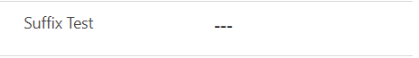

# PCF Prefix Suffix Control

## Overview

Prefix Suffix Control allows show the prefix and suffix on the numeric input fields. Prefix and suffix values are not stored to the value of the field.

**Control supports only suffix at the moment, prefix will be added soon!!!**

## Download

## Configuration

| Field  | Description                                                  |
| ------ | ------------------------------------------------------------ |
| Suffix | String value that will be shown at the end of your input value as suffix. |

## Preview

## Features

- Show suffix at the end of the input field